# Repository Guidelines

## Project Structure & Module Organization
- `src/app/`: Next.js App Router (routes, API like `api/agent/route.ts`), and global styles (`app/globals.css`).
- `src/components/`: Reusable UI; primitives live in `components/ui/` (e.g., `button.tsx`).
- `src/lib/`: Small helpers and utilities (e.g., `utils.ts`).
- `src/utils/`: WebContainer and runtime helpers (e.g., `webcontainer-snapshot.ts`).
- `src/data/`: Static data (e.g., `webcontainer-files.ts`).
- `public/`: Static assets. `docs/ai-sdk/`: AI SDK notes and examples.

## Build, Test, and Development Commands
- `pnpm i`: Install dependencies (repo uses `pnpm-lock.yaml`).
- `pnpm dev`: Start local dev with Turbopack at `http://localhost:3000`.
- `pnpm build`: Production build of the Next.js app.
- `pnpm start`: Run the production server.
- `pnpm lint`: ESLint (extends Next core‑web‑vitals + TypeScript).

## Coding Style & Naming Conventions
- Language: TypeScript (strict, no emit). Indent: 2 spaces.
- Components: PascalCase filenames (e.g., `AIAgentBar.tsx`, `WebContainer.tsx`).
- Primitives in `components/ui/`: lowercase filenames (e.g., `button.tsx`).
- Functions/vars: `camelCase`; types/interfaces: `PascalCase`.
- Prefer function components + hooks; import via alias `@/*`.
- Run `pnpm lint` and fix warnings before committing.

## Testing Guidelines
- At minimum, validate changed flows manually and ensure ESLint passes.

## Security & Configuration Tips
- Do not commit real secrets. Use `.env.local` (git‑ignored) and provide redacted values; add new keys to a `.env.example`.
- Keep COEP/COOP headers in `next.config.ts` (required for WebContainer) unless you know the implications.
- Agent changes live in `src/app/api/agent/route.ts`: document new tools, keep the system prompt focused.
  - FAL and ElevenLabs proxies live at `src/app/api/ai/fal/route.ts` and `src/app/api/ai/eleven/route.ts`.
  - Media ingestion endpoint: `src/app/api/media/ingest/route.ts`. Allowed origins include `fal.run`, `fal.media`, `v3.fal.media`, `cdn.fal.ai`, `api.elevenlabs.io`, and ElevenLabs CDN hosts.

### AI Providers (FAL, ElevenLabs)
- Add `FAL_API_KEY` and `ELEVENLABS_API_KEY` to your `.env.local`.
- Server proxies:
  - `POST /api/ai/fal` → proxies to `https://fal.run/<model>`
  - `POST /api/ai/eleven` → proxies to `https://api.elevenlabs.io/v1/music`
- In WebContainer apps, import helpers from `/src/ai` instead of calling providers directly:
  - `callFluxSchnell(input)` → FLUX.1 [schnell] via FAL
  - `callFal(model, input)` → generic FAL model call
  - `composeMusic(params)` → ElevenLabs Music
These route through a message bridge and keep keys on the server.
  - AI outputs containing media URLs or base64 are post‑processed: assets are ingested via `/api/media/ingest` and results are rewritten to durable FYOS public URLs.

## Agent Tools
- web_fs_find: List files/folders in WebContainer
- web_fs_read: Read a file
- web_fs_write: Write a file (creates dirs)
- web_fs_mkdir: Create a directory
- web_fs_rm: Remove a file/folder
- web_exec: Spawn a process (e.g., `pnpm add react`)
- create_app: Scaffold an app entry in `src/apps/<id>` and update registry
- rename_app: Rename app in registry by id
- remove_app: Remove app folder and registry entry
- validate_project: Run checks (scope: `quick`)
- submit_plan: Submit a structured execution plan before edits
- web_search: Server-side web search via Exa (requires `EXA_API_KEY`)

## Validation & Diagnostics
- Manual validation: Use the `validate_project` tool.
  - `quick`: TypeScript `pnpm exec tsc --noEmit` and ESLint on changed files (`pnpm exec eslint --max-warnings=0 <files>`).
- Preview errors: The host dispatches a `wc-preview-error` event for uncaught exceptions/unhandled rejections from preview iframes; `AIAgentBar` auto‑posts a diagnostic to the agent on first occurrence.

##Architecture

```mermaid
graph TB
    subgraph "Next.js Host Application"
        AIBar[AIAgentBar.tsx]
        WCProvider[WebContainerProvider]
        AIBar --> WCProvider
    end
    
    subgraph "WebContainer Iframe"
        direction TB
        WCInstance[WebContainer Instance]
        Desktop[Desktop.tsx]
        Registry[apps/registry.json]
        
        WCInstance --> Desktop
        Desktop --> Registry
        
        subgraph "Desktop Window Management"
            WindowManager[Window Manager]
            TabSystem[Tab System]
            SnapOverlay[Snap Overlay]
            IconManager[Icon Manager]
        end
        
        Desktop --> WindowManager
        Desktop --> TabSystem
        Desktop --> SnapOverlay
        Desktop --> IconManager
    end
    
    subgraph "Individual App Iframes"
        direction TB
        AppHTML[app.html]
        
        subgraph "App Examples"
            Finder[finder/index.tsx]
            Safari[safari/index.tsx] 
            Notes[notes/index.tsx]
            Terminal[terminal/index.tsx]
            Settings[settings/index.tsx]
            AppStore[app-store/index.tsx]
        end
        
        AppHTML --> Finder
        AppHTML --> Safari
        AppHTML --> Notes
        AppHTML --> Terminal
        AppHTML --> Settings
        AppHTML --> AppStore
    end
    
    %% Message Passing
    AIBar -.->|"postMessage('FYOS_OPEN_APP')"| Desktop
    Desktop -.->|"postMessage('FYOS_DESKTOP_READY')"| AIBar
    AppStore -.->|"postMessage('FYOS_INSTALL_APP')"| WCInstance
    
    %% AI Communication
    subgraph "AI Communication Bridge"
        AIBridge[AI Request Bridge]
    end
    
    Finder -.->|"AI_REQUEST via window.top"| AIBridge
    Safari -.->|"AI_REQUEST via window.top"| AIBridge
    Notes -.->|"AI_REQUEST via window.top"| AIBridge
    AIBridge -.->|"AI_RESPONSE"| Finder
    AIBridge -.->|"AI_RESPONSE"| Safari
    AIBridge -.->|"AI_RESPONSE"| Notes
    
    %% File System Operations
    AIBar -->|"Tool Calls (web_fs_*)"| WCInstance
    WCInstance -->|"File Operations"| Registry
    
    %% Window Management
    WindowManager -->|"Creates/Manages"| AppHTML
    TabSystem -->|"Tab Navigation"| AppHTML
    
    %% Event System
    subgraph "Event System"
        TilingEvents[FYOS_TILING Events]
        PreviewErrors[wc-preview-error Events]
    end
    
    WindowManager --> TilingEvents
    AppHTML --> PreviewErrors
    PreviewErrors --> AIBar
    
    %% Styling and Assets
    subgraph "Shared Resources"
        TailwindCSS[tailwind.css]
        DesktopCSS[desktop/styles.css]
        AIHelpers[ai/index.ts]
    end
    
    AppHTML --> TailwindCSS
    Desktop --> DesktopCSS
    Finder --> AIHelpers
    Safari --> AIHelpers
    Notes --> AIHelpers
    
    %% Data Flow
    classDef hostApp fill:#e1f5fe
    classDef webcontainer fill:#f3e5f5
    classDef appIframe fill:#e8f5e8
    classDef messaging fill:#fff3e0
    classDef events fill:#fce4ec
    
    class AIBar,WCProvider hostApp
    class WCInstance,Desktop,Registry,WindowManager,TabSystem,SnapOverlay,IconManager webcontainer
    class AppHTML,Finder,Safari,Notes,Terminal,Settings,AppStore appIframe
    class AIBridge messaging
    class TilingEvents,PreviewErrors events
```

This diagram shows:

**Three Main Layers:**
1. **Next.js Host Application** - The outer shell with AIAgentBar and WebContainerProvider
2. **WebContainer Iframe** - Contains the desktop environment and window management
3. **Individual App Iframes** - Each app runs in its own sandboxed iframe

**Key Communication Patterns:**
- **Host ↔ WebContainer**: Tool calls for file operations, app creation messages
- **WebContainer ↔ Apps**: Desktop readiness, app opening, installation messages  
- **Apps ↔ Host**: AI requests bypass WebContainer and go directly to host via `window.top`
- **Internal Events**: Tiling events for window snapping, preview error events for debugging

**Architecture Highlights:**
- Apps are completely sandboxed in their own iframes
- AI communication bypasses the desktop and goes directly to the host
- The desktop manages windows, tabs, and user interactions
- File system operations flow from AIAgentBar through WebContainer tools
- Error handling and preview errors bubble up to the AI agent for automatic fixing